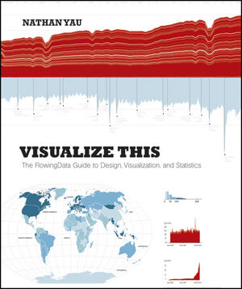

# Visualize This

## Toc  
* [Ch1 Telling Stories with Data]()  
* [Ch2 Handling Data]()  
* [Ch3 Choosing Tools to Visualize Data]()  
* [Ch4 Visualizing Patterns over Time]()  
* [Ch5 Visualizing Proportions]()  
* [Ch6 Visualizing Relationships]()  
* [Ch7 Spotting Differences]()  
* [Ch8 Visualizing Spatial Relationships]()  
* [Ch9 Designing with a Purpose]()  
